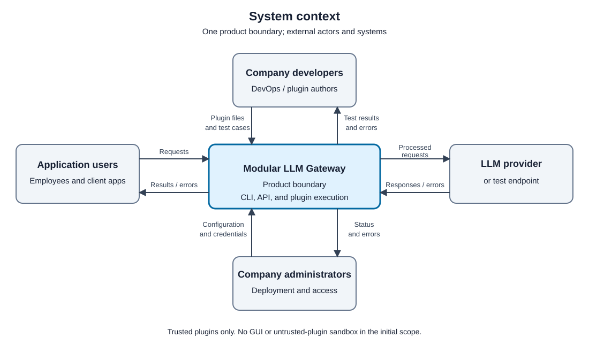

# Product vision

Modular LLM Gateway, Team 1 - Absolute cinema.

## Goal

A company developer can create, test, and enable custom rules for LLM requests and responses without changing the gateway core or calling a live LLM during plugin tests.

Supports [VP-01](research/value-proposition.md#vp-01) and [VP-02](research/value-proposition.md#vp-02).

The first version lets a developer add two simple plugins, start the system, send text, and check the result using a test server with fixed responses. This makes plugin tests repeatable without paying for LLM calls.

The [planned design](decisions.md#1-architecture) uses a Java gateway, Python plugin files, and a CLI. Plugins may be installed with a restart. Loading plugins without a restart is optional.

## Stakeholders

- **Company developers and DevOps engineers:** write plugins and connect applications to the gateway. They need a simple interface and tests they can run locally.
- **Company administrators:** run the system, set plugin order, and manage provider access. They need clear configuration and error messages.
- **Employees and application users:** send requests and receive responses. The gateway must apply the company's rules to their requests.
- **Company owners or IT budget holders:** pay for hosting and LLM usage. They need a system that fits the company's existing tools.
- **Security teams and people whose data appears in requests:** need control over which data is sent to providers or saved in logs.
- **Customer:** checks the scope and tries the plugin workflow.
- **LLM providers:** receive requests and return model responses.

## Constraints

### CON-01

The project must be built within the course schedule.

- **Status:** Active
- **Source:** Environmental - the course schedule.
- **What it costs:** we start with a small number of providers and focus on making plugins work.

### CON-02

The team has four members and shared experience with Java.

- **Status:** Active
- **Source:** Team-given - the team roster and the [kickoff discussion](../reports/week-01/meeting-report.md#disagreements).
- **What it costs:** four people must build and maintain the system. New tools take time to learn.

### CON-03

Provider APIs require valid credentials and have usage limits.

- **Status:** Active
- **Source:** Environmental - the selected provider's API.
- **What it costs:** live tests need credentials and may cost money. We use a test server for repeatable plugin tests and handle provider errors separately.

### CON-04

Public files must not contain secrets or private-only material.

- **Status:** Active
- **Source:** Environmental - the assignment's publication rules.
- **What it costs:** we use sample data in demos and remove private information from screenshots and logs before publishing them.

## Boundary

### BND-01

Generate responses to model requests.

- **Status:** Active
- **Handled by:** The LLM provider, or a test server with fixed responses.
- **Why:** the gateway processes requests and responses. Building a model is outside our scope under [CON-01](#con-01).

### BND-02

Choose the company's security, filtering, and logging rules.

- **Status:** Active
- **Handled by:** Company developers and DevOps engineers, using policies supplied by their security teams.
- **Why:** each company writes its own rules as plugins. The gateway provides the interface described in [GAP-01](research/gap-analysis.md#gap-01).

### BND-03

Manage the company's provider accounts.

- **Status:** Active
- **Handled by:** Company administrators.
- **Why:** administrators set up accounts and give the gateway access. The gateway uses those credentials under [CON-03](#con-03).

### BND-04

Run untrusted plugins in a secure sandbox.

- **Status:** Active
- **Handled by:** Nobody in the first version. Administrators must install trusted plugins only.
- **Why:** a secure sandbox is too much work for the first version. This limit is recorded in [rejected gaps](research/gap-analysis.md#rejected-05-full-enterprise-grade-plugin-security-and-sandboxing) and follows from [CON-01](#con-01).

### BND-05

Provide a graphical user interface.

- **Status:** Active
- **Handled by:** Nobody in the first version. Users have a CLI and an API.
- **Why:** a GUI is not required, as recorded in the [Week 2 meeting report](../reports/week-02/meeting-report.md#meeting-summary). We focus on adding and running plugins.

## System context

Users send text through the CLI or API. Developers add plugin files and test cases. Administrators configure the system and provider access. The provider returns model responses; the test server returns fixed responses during tests.

The CLI, gateway, and plugin runtime belong to the product. Security teams give policy requirements to developers, and budget holders pay for the system. They do not use a separate product interface.

Diagram source: [context.py](architecture/context.py).

## Where the detail lives

- [User stories](https://github.com/itpd-absolute-cinema/llm-module-gateway/issues?q=label%3Auser-story)
- [Week 2 report](../reports/week-02/README.md)
- [Customer validation](../reports/week-02/meeting-report.md)
